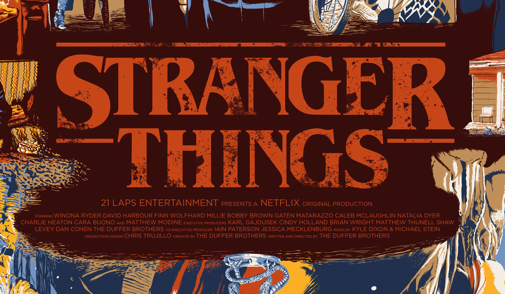

<!DOCTYPE html>
<html xmlns="http://www.w3.org/1999/xhtml">
<head>
<meta charset="utf-8">
  <meta name="viewport" content="width=device-width, initial-scale=1">
  <link rel="stylesheet" href="https://maxcdn.bootstrapcdn.com/bootstrap/3.4.1/css/bootstrap.min.css">
  
  
  <link rel="stylesheet" href="https://cdnjs.cloudflare.com/ajax/libs/font-awesome/4.7.0/css/font-awesome.min.css">
  <link rel="stylesheet" href="C:\Users\Karthikn\Downloads\moviehunter\css/style.css" type="text/css" media="all" />

</head>
<body>

<nav class="navbar navbar-inverse">
  

    

      <a class="navbar-brand" href="#">KnFavors</a>
    

    <ul class="nav navbar-nav">
      <li ><a href="https://www.netflix.com">Home</a></li>
      <li><a href="aboutus.html">about us</a></li>
      <li><a href="service.html">Services</a></li>
    </ul>
    <form class="navbar-form navbar-left" action="/action_page.php">
      

        <input type="text" class="form-control" placeholder="Search" name="search">
        

          <button class="btn btn-default" type="submit">
            <i class="glyphicon glyphicon-search"></i>
          </button>
        

      

    </form>
     <ul class="nav navbar-nav navbar-right">
      <li><a href="#"data-toggle="modal" data-target="#myModal"> Sign Up</a></li>
      <li><a href="index1.html"> Login</a></li>
    </ul>
  

</nav>

<!--slide starts here-->

  

    <!-- Indicators -->
    <ol class="carousel-indicators">
      <li data-target="#myCarousel" data-slide-to="0" class="active"></li>
      <li data-target="#myCarousel" data-slide-to="1"></li>
      <li data-target="#myCarousel" data-slide-to="2"></li>
    </ol>

    <!-- Wrapper for slides -->
    

      

        
      

      

        
      

      

        
      

    

    <!-- Left and right controls -->
    <a class="left carousel-control" href="#myCarousel" data-slide="prev">
      
      Previous
    </a>
    <a class="right carousel-control" href="#myCarousel" data-slide="next">
      
      Next
    </a>
  

<!--slide ends here-->

<!--movie start here-->

 

    

      

        

          <h1>Most Popular</h1>
          
<a href="https://www.imdb.com/list/ls095964455/">See all</a>

        

        

       
          
 
          
            

            

         

          

            
RATING

            

              
 

            

            12 

        

        

          
 

            

            

          

            
RATING

            

              
 

            

            18 

        

        

          
 
            

            

          

            
RATING

            

              
 

            

            5 

        

        

          
 
  

          

            
RATING

            

              
 

            

            8 

        

        

          
 
  

          

            
RATING

            

              
 

            

            11 

        

        

          
 
  

          

            
RATING

            

              
 

            

            20 

        

        
&nbsp;

      

      

        

          <h1>Trending Now</h1>
          
<a href="https://www.imdb.com/search/title/?title_type=tv_series">See all</a>

        

        

          
 
  

          

            
RATING

            

              
 

            

            15 

        

        

          
 
  

          

            
RATING

            

              
 

            

            4 

        

        

          
 
  

          

            
RATING

            

              
 

            

            7 

        

        

          
 
  

          

            
RATING

            

              
 

            

            9 

        

        

          
 
  

          

            
RATING

            

              
 

            

            17 

        

        

          

  

          

            
RATING

            

              
 

            

            13 

        

        
&nbsp;

      

      

        

          <h1>Returing this week</h1>
          
<a href="https://editorial.rottentomatoes.com/article/tv-premiere-dates-2020/">See all</a>

        

        

          
 
  

          

            
RATING

            

              
 

            

            16 

        

        

          
 
  

          

            
RATING

            

              
 

            

            11 

        

        

          
 
  

          

            
RATING

            

              
 

            

            12 

        

        

          
 
  

          

            
RATING

            

              
 

            

            6 

        

        

          
 
  

          

            
RATING

            

              
 

            

            16 

        

        

          
 
  

          

            
RATING

            

              
 

            

            8 

        

        
&nbsp;

      

    

      

        <h3>NEWS</h3>
        
<a href="https://www.independent.co.uk/topic/netflix">See all</a>

      

      

        <h4>The Crown</h4>
        
Season four of Netflix’s hit show The Crown launches on Sunday (15 November), and will introduce a host of new characters, including Gillian Anderson’s hugely anticipated turn as Margaret Thatcher. 

        <a href="https://www.independent.co.uk/arts-entertainment/netflix/the-crown/prince-philip-the-crown-queen-elizabeth-b1760470.html">Read more</a> 

      

        
        <h4>Where the Wild Things Are</h4>
        
Innovative director Spike Jonze collaborates with celebrated author Maurice Sendak to bring one of the most beloved books of all time to the big screen in &quot;Where the Wild Things Are,&quot;...

        <a href="#">Read more</a> 

      

        
        <h4>The Box</h4>
        
Norma and Arthur Lewis are a suburban couple with a young child who receive an anonymous gift bearing fatal and irrevocable consequences.

        <a href="#">Read more</a> 

    

    

      

        <h3>COMING SOON<strong>!</strong></h3>
        
<a href="#">See all</a>

      

      

        <h4>The Uncanny Counter </h4>
        
        
Demon hunters pose as workers in a noodle shop in an effort to catch evil spirits hoping to find eternal life.

        <a href="https://www.google.com/search?q=the+uncanny+counter&source=lmns&bih=530&biw=1280&rlz=1C1CHBF_enIN919IN919&hl=en&sa=X&ved=2ahUKEwiq3dP0sJrtAhWY_3MBHXZzDXUQ_AUoAHoECAEQAA">Read more</a> 

      
&nbsp;

      

        <h4>Great Pretender, Season 2 </h4>
        
        
In the second season of this con-man anime, even as Makoto tries to leave Laurent's nefarious team, he finds they're still connected in unexpected ways and keeps getting pulled back in for bold heist jobs..

        <a href="#">Read more</a> 

    

    
&nbsp;

  

  

    
Copyright &copy; 2020 <a href="#">SiteName</a> - All Rights Reserved

    
Design by <a href="#">Karthikeyan S</a>

    

  

 

<!-- movie ends here-->

 <!--model starts here-->
 

  <!-- Modal -->
  

    

      <!-- Modal content-->
      

        

          <button type="button" class="close" data-dismiss="modal">&times;</button>
          <h4 class="modal-title">Sign up</h4>
        

        

          

   <label for="usr">Username:</label>
    <input type="text" class="form-control" placeholder="Enter Username" id="usr">
   
  

  

  <label for="pwd">Password:</label>
  <input type="password" class="form-control" placeholder="Enter password" id="pwd">
     

  

   <label for="pwd">Repeat Password:</label>
   <input type="password" class="form-control" placeholder="Enter password" id="pwd">
  

    

  <label for="pwd">Email</label>
  <input type="Email ID" class="form-control" placeholder="Enter Email" id="pwd">
      

       

  
      <input type="submit"value="create account" class="btn btn-success btn-block"/> 
        

          <h4>Or</h4>
        
  
        
             
                      
      

        

      

    

  

<!--model ends here-->
</body>
</html>

